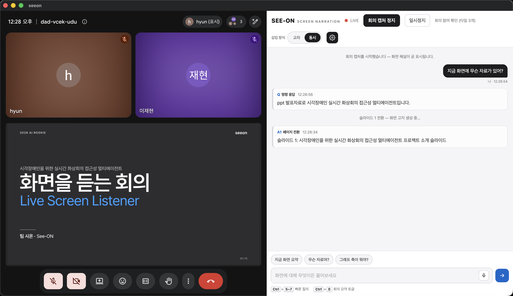
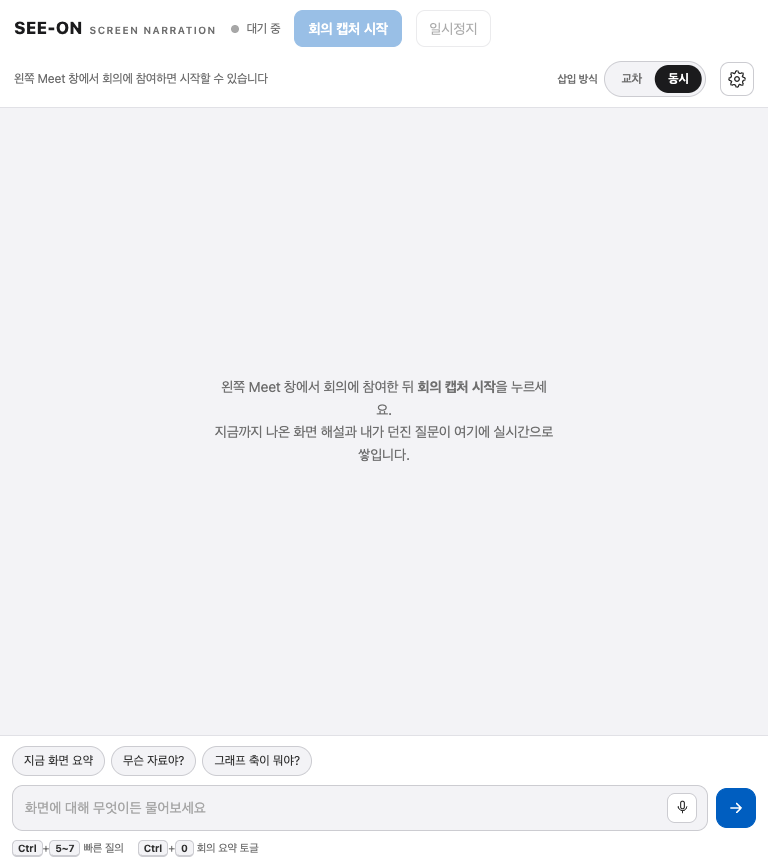
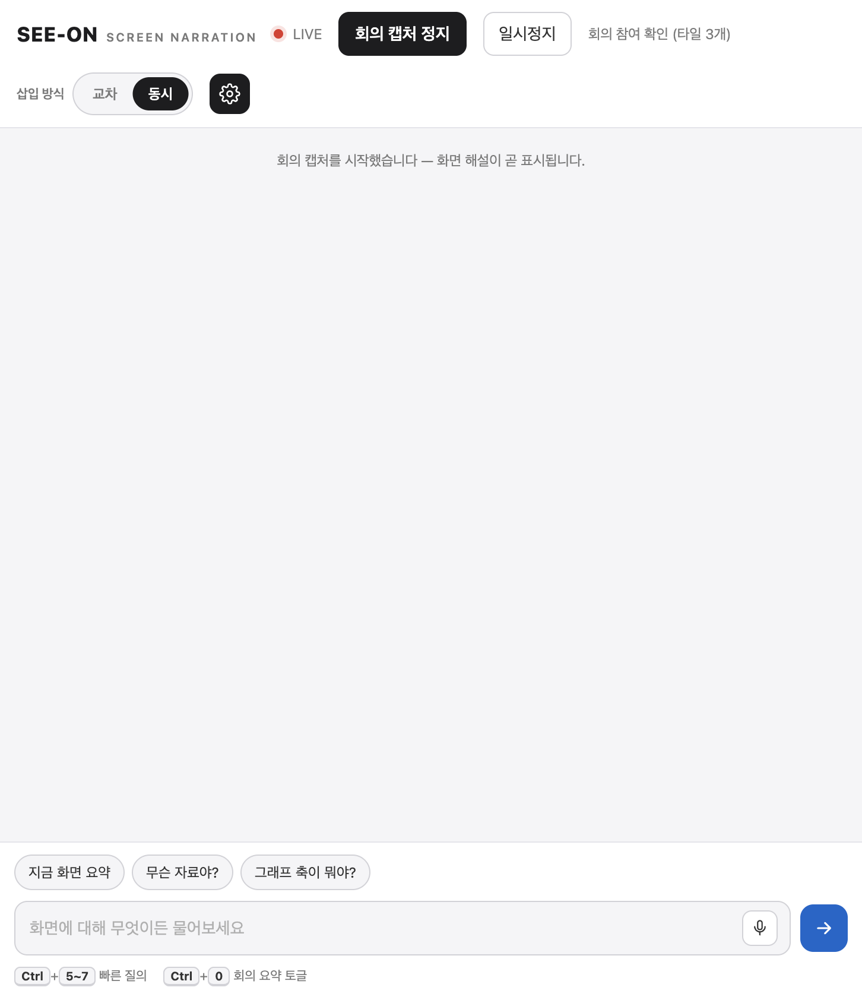
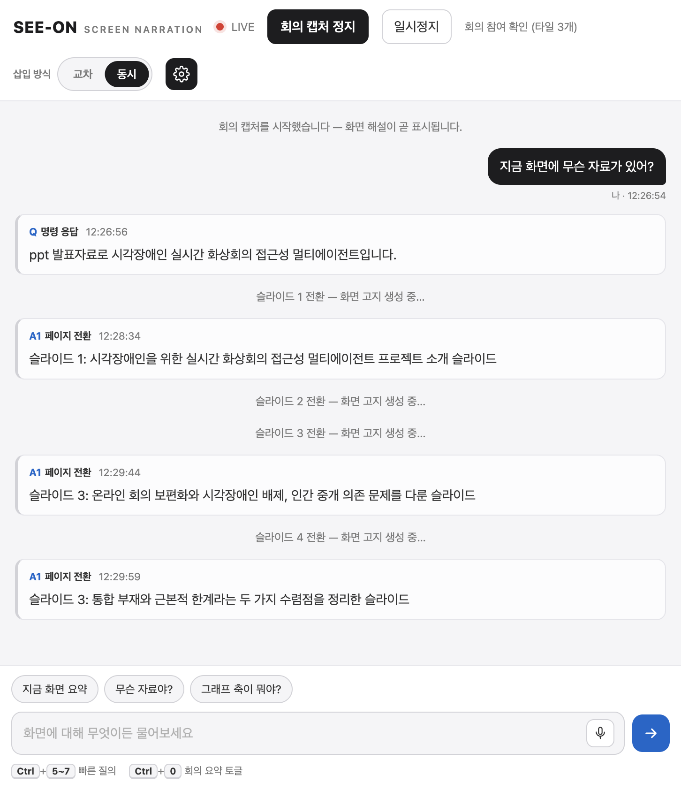
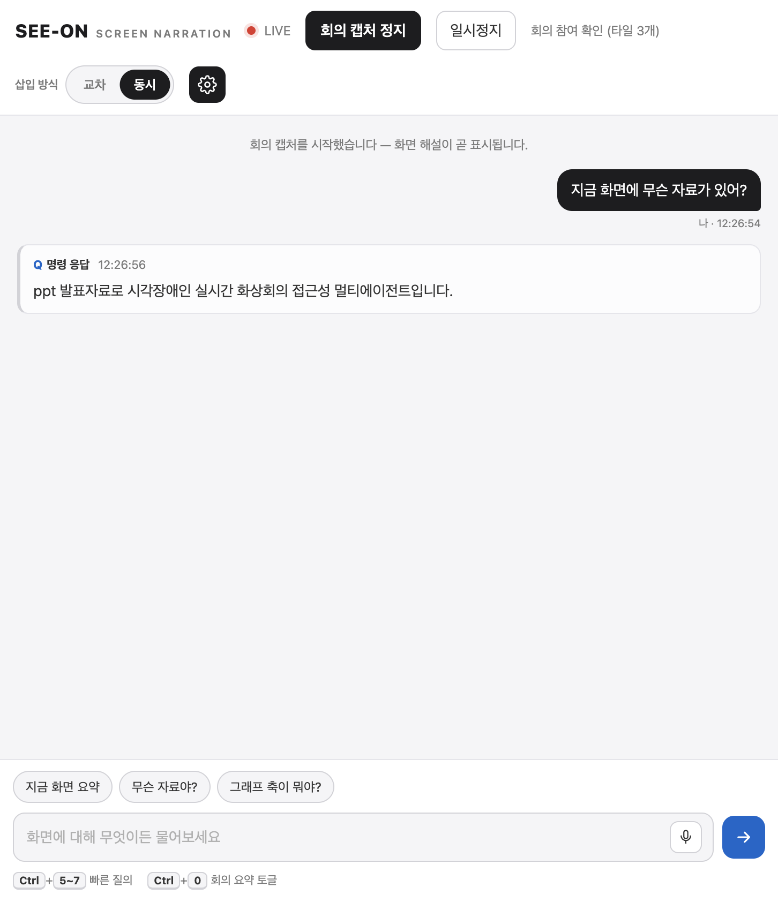
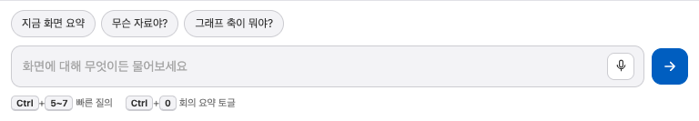
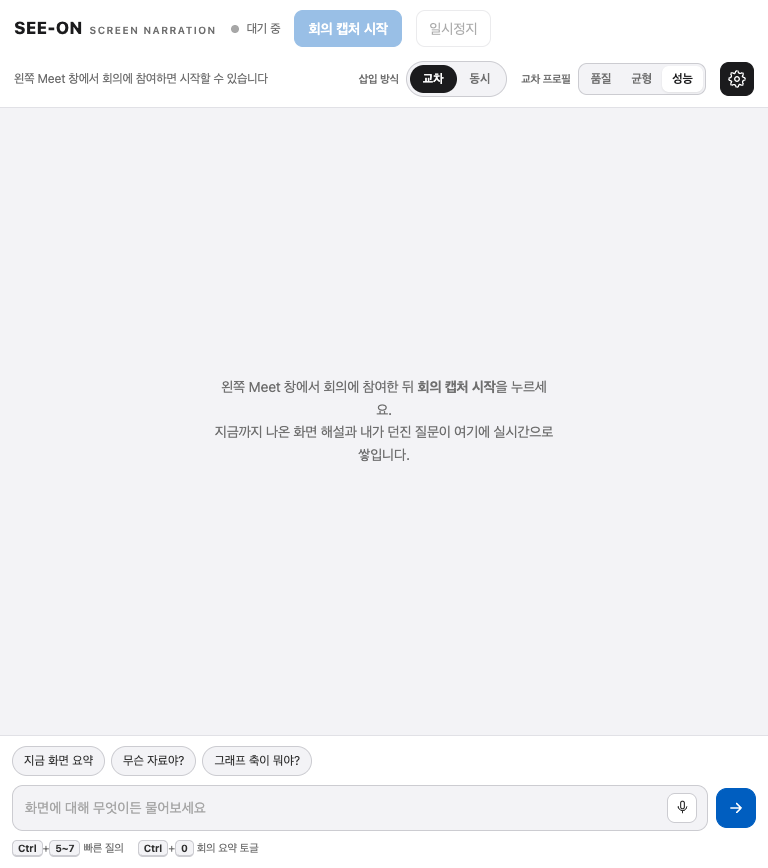
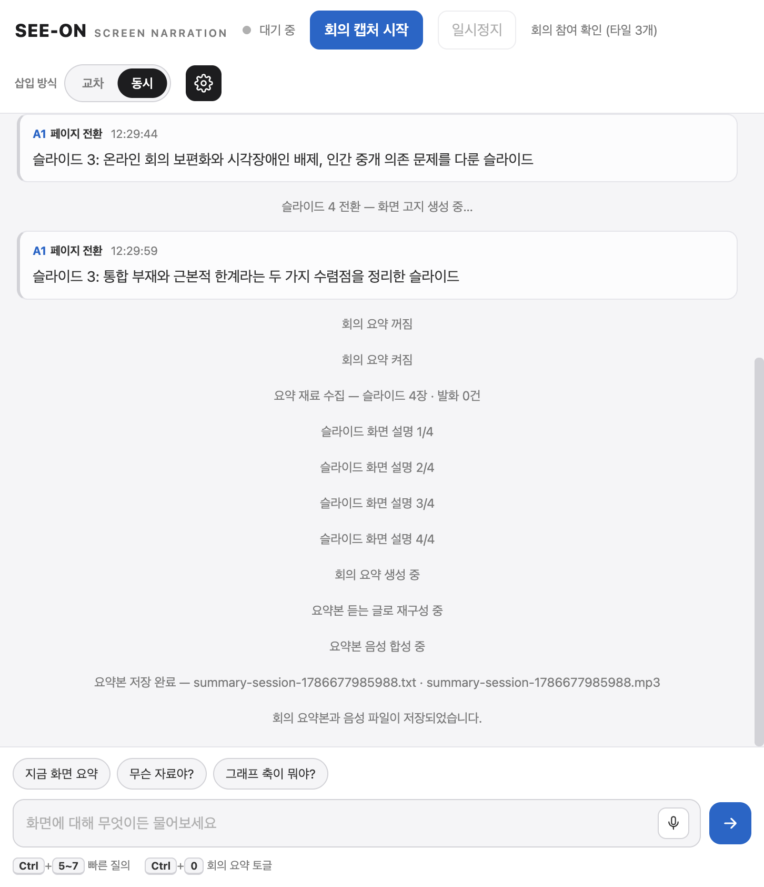
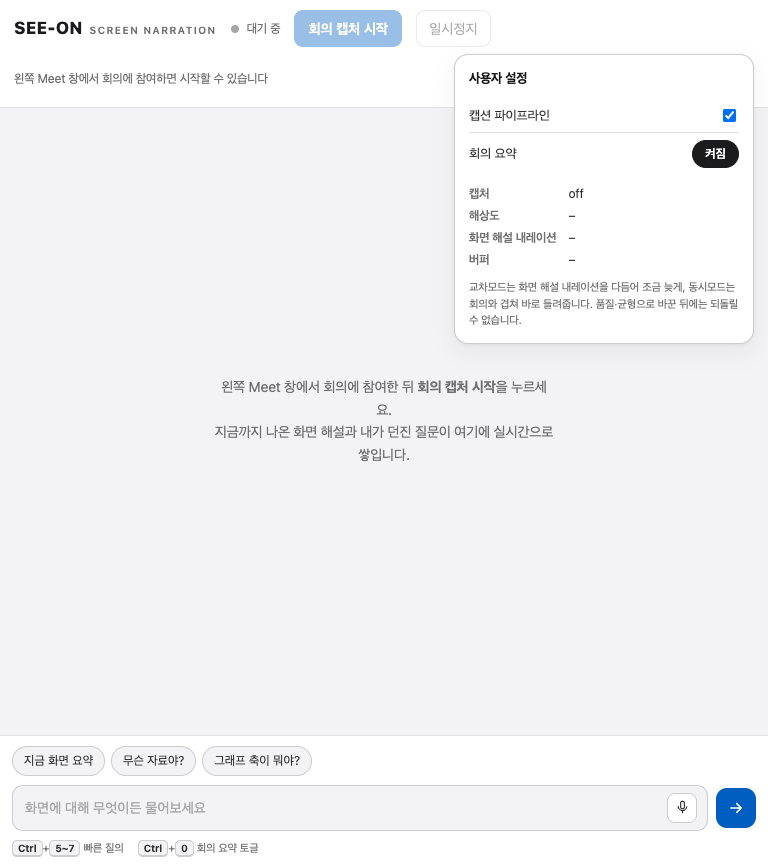

# seeon — 실시간 회의 시각 정보 음성 안내

**seeon(視溫, See-ON)** 은 시각장애인 참가자가 **다른 사람의 도움 없이 스스로** 화상회의를
따라갈 수 있게 하려고 만드는 앱이에요. 화면 공유가 시작되면 지금까지 시각장애 사용자는
"옆 사람에게 지금 화면에 뭐가 떠 있는지" 물어야 했는데, seeon은 그 자리를 소프트웨어가
대신 채워서 정보 접근의 비대칭을 없애는 걸 목표로 해요.

화상회의에서 **발화와 화면은 한 세트**예요. 발표자는 화면이 채워 줄 걸 전제로 절반만 말하죠.
그래서 seeon이 하는 일은 화면을 통째로 읽어 주는 게 아니라, **발화가 남긴 정보 공백**을 찾아
그 부분만 짧은 음성 안내(화면 해설 내레이션)로 채우는 거예요. 이미 말로 설명된 내용은
다시 말하지 않아요 — 무엇을 말할지만큼 **언제 말하지 않을지**를 중요하게 여겨요.

앱 안에 Google Meet 회의를 띄우고 화면과 소리를 함께 받아서, 발표 자료가 바뀌거나 발표자가
화면의 무언가를 가리킬 때 그 상황을 짧은 문장으로 만들어 읽어줘요. 회의뿐 아니라 **화면과
소리가 함께 흐르는** 자리(온라인 강의·세미나 등)로 넓혀 가는 걸 바라보고 있어요.



> 왼쪽은 실제 Google Meet 회의(발표 화면 공유 중)이고, 오른쪽은 seeon이 만든 화면 해설이
> 실시간으로 쌓이는 패널이에요.

---

## 목차

- [화면 구성](#화면-구성)
- [준비물](#준비물)
- [설치와 실행](#설치와-실행)
- [회의 시작하기](#회의-시작하기)
- [무엇을 언제 말해 주는가](#무엇을-언제-말해-주는가)
- [직접 물어보기](#직접-물어보기)
- [안내 타이밍 — 삽입 방식과 프로필](#안내-타이밍--삽입-방식과-프로필)
- [회의 요약](#회의-요약)
- [소리가 나가는 방식](#소리가-나가는-방식)
- [안내를 하지 않는 경우](#안내를-하지-않는-경우)

---

## 화면 구성

창은 좌우로 나뉘어요. **왼쪽은 Google Meet**, **오른쪽은 화면 해설 패널**이에요.
회의는 왼쪽에서 평소처럼 진행하고, 오른쪽 패널이 화면을 대신 읽어줘요.



오른쪽 패널은 세 부분으로 이뤄져 있어요.

- **위쪽 머리줄** — 로고, 라이브 상태(`대기 중` ↔ `LIVE`), `회의 캡처 시작` 버튼,
  `삽입 방식` 전환, 설정(톱니) 아이콘이 있어요.
- **가운데 스트림** — 화면 해설 카드와 내가 던진 질문이 채팅처럼 위에서 아래로 쌓여요.
  지금 읽고 있는 카드는 파란색으로 강조돼요.
- **아래쪽 입력줄** — 빠른 질의 버튼, 질문 입력창, 음성 질문 버튼, 그리고 단축키 안내가 있어요.

---

## 준비물

- **Google Meet 계정** — 왼쪽 창에서 회의에 참여하는 데 써요.
- **헤드셋** — 스피커로 들으면 안내 음성이 마이크를 타고 회의로 새어 나가니 꼭 써주세요.
- **화면 해설 서버(VLM·ASR·TTS)** — 화면을 읽고, 소리를 받아쓰고, 안내를 목소리로 바꿔 주는
  로컬 HTTP 서버예요. 아래 두 가지 방법 중 하나로 준비하면 돼요.
  - **실서버**: `127.0.0.1`의 VLM(8801)·ASR(8802)·TTS(8803)에 연결해요.
    (원격 GPU라면 SSH 터널로 로컬 포트에 붙이면 돼요.)
  - **목 서버**: 서버가 없어도 `npm run mock` 으로 흉내만 내는 서버를 띄워서 UI를 확인할 수 있어요.
- **AWS Bedrock 키(선택)** — 안내 문장을 다듬고 회의 요약을 만드는 데 써요.
  없으면 규칙 기반으로 대체 동작해요.
- **macOS** — macOS에서 만들고 확인했어요.

---

## 설치와 실행

```bash
# 1) 의존성 설치
npm install

# 2) 환경 변수 준비 (실서버·Bedrock을 쓸 때만 값 채움)
cp .env.example .env
#   .env 없이도 목 서버(npm run mock)로는 동작해요.

# 3) 앱 실행
npm start
```

`.env`의 주요 값이에요.

| 변수 | 의미 | 기본값 |
|---|---|---|
| `SEEON_VLM_URL` | 화면을 읽는 서버 | `http://127.0.0.1:8801/...` |
| `SEEON_ASR_URL` | 소리를 받아쓰는 서버 | `http://127.0.0.1:8802/asr` |
| `SEEON_TTS_URL` | 안내를 목소리로 바꾸는 서버 | `http://127.0.0.1:8803/tts` |
| `AWS_BEARER_TOKEN_BEDROCK` | Bedrock 키 (비우면 규칙 기반 대체) | 비어 있음 |

> 서버 없이 화면만 둘러보고 싶다면, 터미널 한 곳에서 `npm run mock`, 다른 곳에서 `npm start` 를 실행해요.

---

## 회의 시작하기

1. 왼쪽 **Google Meet** 창에서 회의에 참여해요.
2. 발표 자료 안내를 받으려면 발표자가 **화면을 공유**해야 해요.
   (내가 발표한다면 창·문서 단위로 공유해요. 전체 화면 공유는 앱이 거울처럼 반복되니 피하는 게 좋아요.)
3. 오른쪽 패널이 회의 참여를 감지하면 `회의 캡처 시작` 버튼이 켜져요. 이 버튼을 눌러요.



캡처가 시작되면 머리줄이 **`LIVE`** 로 바뀌고, 잠시 뒤부터 화면이 바뀔 때마다
해설 카드가 스트림에 쌓여요. 멈추고 싶을 땐 `회의 캡처 정지`를 누르면 돼요.

---

## 무엇을 언제 말해 주는가



### 화면이 바뀔 때

발표 자료가 넘어가면 그 화면이 무엇인지 한 문장으로 알려줘요.

> 슬라이드 1: 시각장애인을 위한 실시간 화상회의 접근성 멀티에이전트 프로젝트 소개 슬라이드

- **스쳐 지나간 화면은 말하지 않아요.** 3초 이상 머문 화면만 안내해요.
  (위 스트림에서 슬라이드 2·4가 카드 없이 지나간 게 그 예예요.)
- **이미 봤던 화면으로 되돌아가면 짧게 말해요** — "이전 슬라이드 3: 세션 하이재킹 개념".
- 바탕화면·파일 탐색기·설정 창처럼 회의 내용과 무관한 화면은 조용히 있어요.
- 문장이 자연스럽게 맺히지 않으면 **말하지 않아요.** 어색한 안내는 없느니만 못하니까요.

### 발표자가 화면의 무언가를 가리킬 때

"이거 보시면", "여기 이 부분이" 같은 발화가 나오면, 그 순간 화면에서 무엇을 가리키는지 찾아서
발화와 이어 붙여 말해줘요.

> 왼쪽 위 매출 추이 표를 보는 중

가리키는 대상을 화면에서 찾지 못하면 **추측하지 않고 조용히 있어요.**

### 숫자와 주장을 이어야 할 때

발화에는 수치만 나오고 그 의미가 화면에 있을 때(또는 그 반대일 때) 둘을 이어줘요.

> 73%는 작년 대비 기업가치 성장률을 의미

### 사진이 단독으로 제시될 때

발표자가 설명 없이 사진만 띄우면, 사진에 무엇이 있는지 알려줘요. 크기를 가늠하기 어려운
대상은 화면 속 다른 물체와 비교해서 말해줘요.

> 소나무보다 4배 큰 불상

### 말하는 사람이 바뀔 때

발화자가 바뀌면 누구인지 알려줘요. 같은 사람이 계속 말하는 동안에는 반복하지 않아요.

> hyun님이 말합니다

- 회의 앱이 표시하는 발화자 정보를 먼저 쓰고, 그것으로 알 수 없으면 화면을 읽어서 판단해요.
- 카메라를 끈 참가자도 화면의 강조 표시로 찾아내요.
- 여러 명이 동시에 말하거나 본인이 말할 때는 안내하지 않아요.

---

## 직접 물어보기

궁금할 때 아래 입력줄로 물어볼 수 있어요. **그 순간의 화면을 보고** 답해줘요.



물어보는 방법은 세 가지예요.



- **자유롭게 타이핑** — 입력창에 무엇이든 적어 보내요. ("지금 화면에 무슨 자료가 있어?")
- **빠른 질의 버튼** — `지금 화면 요약` · `무슨 자료야?` · `그래프 축이 뭐야?`.
- **단축키** — 손을 떼지 않고 바로 물어봐요.

| 단축키 | 묻는 것 |
|---|---|
| `Ctrl+5` | 지금 어떤 자료가 공유되고 있나 (자료의 형태와 주제) |
| `Ctrl+6` | 이 화면에 있는 자료를 빠짐없이 정리해 달라 |
| `Ctrl+7` | 그래프의 가로축·세로축이 무엇이고 단위와 범위는 어떻게 되나 |

화면에 그래프가 없는데 `Ctrl+7`을 누르면 지어내지 않고 없다고 답해줘요.

> 음성으로 묻는 마이크 버튼은 지금 준비 중이에요. 당분간은 타이핑이나 빠른 질의를 이용해 주세요.

---

## 안내 타이밍 — 삽입 방식과 프로필

안내를 **언제** 끼워 넣을지 머리줄의 `삽입 방식`에서 고를 수 있어요.



- **동시** — 회의 소리와 안내가 겹쳐서 바로 들려요. 실시간성이 가장 높아요.
- **교차** — 발화가 잠시 쉬는 틈을 노려 안내를 끼워 넣어서 조금 늦게 들려요.
  겹침이 적어서 알아듣기 편해요. 교차를 고르면 세 가지 **프로필**이 나타나요.

| 프로필 | 성격 |
|---|---|
| **품질** | 가장 정교하게 다듬어서 넣어요 (조금 더 느려요) |
| **균형** | 품질과 속도의 절충이에요 |
| **성능** | 가장 빠르게 넣어요 |

> `품질`·`균형`으로 한번 바꾸면 되돌릴 수 없다는 안내가 떠요. 회의 중에는 신중히 골라주세요.

---

## 회의 요약

회의 중 오간 발화와 화면 안내를 모아서 **요약본(글 + 음성)** 을 만들어요.
`Ctrl+0` 으로 요약 기능을 켜고 끌 수 있어요.

요약 기능이 켜진 채로 회의 캡처를 정지하거나 회의를 나가면, 요약본 만들기가 시작돼요.
자료 수집 → 슬라이드별 화면 설명 → 요약 작성 → 낭독용으로 다듬기 → 음성 합성 순으로 진행되고,
완성되면 글 파일과 음성 파일로 저장돼요.



만들어진 요약본은 이런 모습이에요.

> **회의 요약**
> 회의 길이: 5분 · 슬라이드 4장 · 발화 0건
>
> **개요** — 이 회의는 시각장애인을 위한 실시간 화상회의 접근성 멀티에이전트 서비스인
> '화면을 듣는 회의'를 소개하는 자리였습니다. …
>
> **슬라이드별 내용** — 첫 장은 표지였습니다. 서비스 이름과 팀 이름이 함께 놓여 있었고,
> 발표자가 영문명 자리에 커서를 두어 정식 명칭을 짚었습니다. …

저장 위치는 `out/summaries/` 이고, `summary-session-<id>.txt`(글)와
`summary-session-<id>.mp3`(음성)로 남아요.

---

## 소리가 나가는 방식

안내 음성과 회의 소리가 **동시에** 들려요. 서로 방해하지 않도록 공간을 나눠요.

- 안내 음성은 **왼쪽**, 회의 소리는 **오른쪽**에서 들려요.
- 안내가 나가는 동안 회의 소리는 잠시 작아졌다가(−12dB) 원래대로 돌아와요.
- 회의는 멈추지 않아요. 실시간성을 잃지 않으려는 선택이에요.

---

## 안내를 하지 않는 경우

말할 수 있는데 안 하는 게 아니라, **말하면 안 되는 상황을 가려내요.**

- 화면을 보지 않아도 발화만으로 알 수 있는 내용
- 방금 안내한 것과 사실상 같은 내용
- 화면에서 근거를 찾지 못한 추측
- 3초를 못 채우고 지나간 화면
- 문장이 어중간하게 끊긴 안내

설정(톱니) 아이콘을 열면 캡션 파이프라인과 회의 요약을 끄고 켤 수 있고,
지금 캡처·해상도·버퍼 상태도 확인할 수 있어요.


